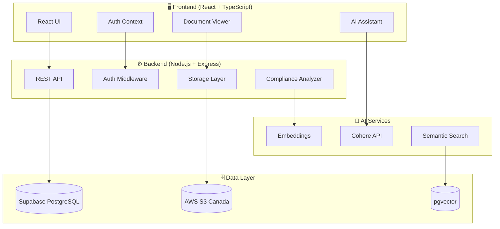

# 📋 SIMPLTerms

### SOC II Compliant AI-Powered Contract Assistant for Enterprises

<p align="center">
  
  
  
  
  
  
</p>

<p align="center">
  <b>An enterprise-grade AI document intelligence platform built for compliance-first industries.</b>
</p>

---

## 🎯 The Problem

Enterprises in **healthcare, legal, and public sectors** struggle with:

- **Contract Overload**: Thousands of contracts requiring manual review
- **Compliance Risks**: Missing critical clauses that expose regulatory risks (PHIPA, PIPEDA, SOC II)
- **Data Sovereignty**: Strict requirements for data residency (Canadian companies must keep data in Canada)
- **Manual Inefficiency**: Legal teams spending 80% of time on routine document review
- **Audit Gaps**: Lack of comprehensive audit trails for compliance reporting

## 💡 The Solution

**SIMPLTerms** is an AI-powered contract assistant that:

✅ **Extracts insights** from PDF contracts using advanced NLP  
✅ **Enables contextual Q&A** through an AI assistant with document context  
✅ **Detects compliance risks** with automated clause scoring  
✅ **Maintains data residency** with Canada-only storage (Supabase + S3)  
✅ **Provides comprehensive audit trails** for SOC II compliance  

---

## ✨ Key Features

### 🔍 **AI-Powered Document Intelligence**
- Upload PDF contracts and get instant text extraction
- Semantic search across all documents using vector embeddings
- Ask questions in natural language and get context-aware answers

### 🛡️ **Compliance Detection Engine**
- Automated clause identification and risk scoring
- Detection of missing standard clauses
- Compliance status dashboards with export functionality

### 🔐 **Enterprise Security & Privacy**
- **Canadian Data Residency**: All data stored in Canada (Supabase CA + S3 Canada)
- **SOC II Ready**: Comprehensive audit logging for all operations
- **JWT + OAuth**: Enterprise-grade authentication with role-based access control
- **Multi-tenant Architecture**: Complete data isolation between organizations

### 📊 **Admin Dashboard**
- User management and access control
- System health monitoring and performance tracking
- Usage analytics and quota management

### 🔄 **Intelligent Processing Pipeline**
- Robust retry logic with automatic failure recovery
- Real-time processing status updates
- Cross-platform compatibility (Windows/Unix)

---

## 🏗️ Architecture



---

## 🛠️ Tech Stack

| Layer | Technology |
|-------|------------|
| **Frontend** | React 18, TypeScript, TailwindCSS, Radix UI |
| **Backend** | Node.js, Express, TypeScript |
| **Database** | Supabase PostgreSQL (Canada Region), Drizzle ORM |
| **Storage** | AWS S3 (Canada Region) with presigned URLs |
| **AI/ML** | Cohere Embeddings, pgvector for similarity search |
| **Auth** | Supabase Auth, JWT + Refresh Tokens, OAuth (Google) |
| **Payments** | Stripe (planned) |
| **Build** | Vite, TypeScript, Biome (linting) |

## 📖 Usage

### 1. Upload Documents
Navigate to the Documents page and upload your PDF contracts. The system will automatically:
- Extract text using PyMuPDF
- Create vector embeddings using Cohere
- Store chunks for semantic search

### 2. Ask Questions
Use the AI Assistant to ask questions about your documents:
- "What are the termination clauses in this contract?"
- "Does this agreement comply with PIPEDA requirements?"
- "Find all liability limitations across my contracts"

### 3. Run Compliance Scans
Access the Compliance Dashboard to:
- Scan documents for standard clause coverage
- Identify missing required clauses
- Export compliance reports (CSV/JSON)

### 4. Admin Controls
Organization admins can:
- Manage user access and roles
- Monitor system health
- View audit logs
- Track usage quotas

---

## 🔒 Security & Compliance

### SOC II Compliance Features

| Control | Implementation |
|---------|----------------|
| **Access Control** | Role-based permissions with JWT authentication |
| **Audit Logging** | Comprehensive logs for all document operations |
| **Data Encryption** | TLS in transit, encrypted storage |
| **Data Residency** | Canada-only data storage |
| **Session Management** | Secure token rotation and expiry |
| **Multi-tenancy** | Complete organization data isolation |

### Privacy Standards Supported
- **PHIPA** (Personal Health Information Protection Act)
- **PIPEDA** (Personal Information Protection and Electronic Documents Act)
- **SOC II Type 2** (Service Organization Control)

---

## 📁 Project Structure

```
simplterms/
├── client/                 # React frontend
│   ├── src/
│   │   ├── components/    # Reusable UI components
│   │   ├── pages/         # Page components
│   │   ├── hooks/         # Custom React hooks
│   │   ├── contexts/      # React contexts
│   │   └── lib/           # Utilities
│   └── ...
├── server/                 # Express backend
│   ├── routes/            # API endpoints
│   ├── middleware/        # Express middleware
│   ├── services/          # Business logic
│   ├── storage/           # Data access layer
│   └── utils/             # Helper functions
├── shared/                 # Shared types & schemas
├── migrations/            # Database migrations
├── tests/                 # Test suites
└── docs/                  # Documentation
```

---

## 🧪 Development Commands

```bash
# Development
npm run dev          # Start full-stack dev server
npm run server:dev   # Backend only
npm run client:dev   # Frontend only

# Build & Production
npm run build        # Build for production
npm run start        # Start production server

# Quality Checks
npm run typecheck    # TypeScript validation
npm run lint         # Biome linting
npm run format       # Code formatting
npm run test         # Run test suite

# Database
npm run db:migrate   # Run migrations
npm run db:generate  # Generate types from schema
```

---

## 📈 Roadmap

- [x] **Phase 0**: Core upload → extract → view pipeline
- [x] **Phase 1**: Retry logic and recovery
- [x] **Phase 2**: UI/UX polish
- [x] **Phase 3**: AI search and semantic retrieval
- [x] **Phase 4**: Compliance detection engine
- [x] **Phase 5**: Admin dashboard
- [x] **Phase 6**: Billing & subscriptions (Stripe)
- [x] **Phase 7**: E2E testing & QA
- [x] **Phase 8**: Pilot launch & onboarding

---

## 👤 Author

**Neeraj Mohanty**

- GitHub: [@NeerajMohanty](https://github.com/NeerajMohanty)
- Project: [applied-ai-projects](https://github.com/NeerajMohanty/applied-ai-projects)

---

<p align="center">
  <b>Built with ❤️ for enterprise compliance</b>
</p>
